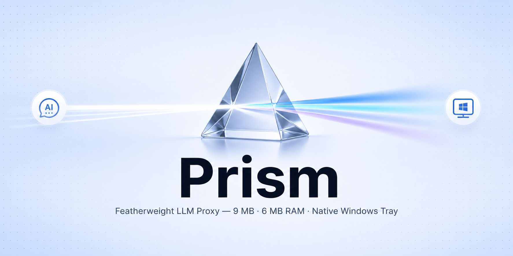

<div align="center">


# Prism

### One proxy. Every LLM API format. A 5 MB Windows binary with zero dependencies.

Prism translates between Anthropic Messages, OpenAI Chat Completions, OpenAI Responses, and Ollama native APIs in real time. Native system tray, built-in web admin UI, model remapping, and full SSE streaming. Zero config.

[](https://github.com/user/prism)
[](https://go.dev/)
[]()



</div>

---

## Why Prism?

Claude Desktop, Cursor, Continue, and other AI tools each expect a specific API format — but cloud providers don't all speak the same language. Prism sits in between, translating requests and responses on the fly so you can point any client at any provider.

**One proxy. Every format. No Python.**

| | Prism | LiteLLM |
|---|---|---|
| **Binary size** | ~5 MB | ~200 MB (Python + deps) |
| **Memory** | ~5–10 MB | ~200–500 MB |
| **Startup** | < 100 ms | ~2–5 s |
| **Runtime deps** | None | Python 3.9+, pip packages |
| **Anthropic API** | ✅ | ✅ |
| **OpenAI Chat API** | ✅ | ✅ |
| **OpenAI Responses API** | ✅ | ❌ |
| **Ollama Native API** | ✅ | ✅ |
| **Streaming (SSE)** | ✅ | ✅ |
| **Model remapping** | ✅ | ✅ |
| **Tool calling** | ✅ | ✅ |
| **Thinking/reasoning** | ✅ | ⚠️ partial |
| **Image support** | ✅ | ✅ |
| **Structured outputs** | ✅ | ⚠️ partial |
| **Web admin UI** | ✅ | ❌ |
| **Windows native** | ✅ System tray + admin UI | ❌ Requires Python |

## How it works

```
  Your tools                              Cloud providers
  ─────────                               ────────────────

  Claude Desktop ──┐
  (Anthropic API)  │                       ┌──────────────┐
                   │    ┌───────────┐       │  Ollama Cloud │
  Cursor ──────────┼───→│   Prism   │──────→│  /api/chat    │
  (OpenAI API)     │    │  :11434   │       └──────────────┘
                   │    └───────────┘       ┌──────────────┐
  Continue ────────┤         │              │  OpenCode Go  │
  (OpenAI API)     │         │              │  /v1/chat/... │
                   │         │              └──────────────┘
  OpenAI SDK ──────┘         │              ┌──────────────┐
  (Responses API)            ├──────────────→│  Custom       │
                             │              │  /v1/chat/... │
                             │              └──────────────┘
                             │
                        ┌────┴────┐
                        │ Admin UI │
                        │  :8765  │
                        └─────────┘

                    ┌────────────────────┐
                    │  Codex (via OAuth) │── Sign in with OpenAI
                    │  /v1/chat/...      │   account — no API key
                    └────────────────────┘   needed
```

Prism accepts requests in **Anthropic Messages** format (`/v1/messages`), **OpenAI Chat Completions** format (`/v1/chat/completions`), or **OpenAI Responses** format (`/v1/responses`), translates them to whatever your upstream provider speaks, and translates responses back. Streaming works seamlessly in all directions.

## Quick start

### 1. Run Prism

```powershell
./prism.exe
```

That's it. Prism starts on `http://127.0.0.1:11434` and a system tray icon appears. A web admin UI is available at `http://127.0.0.1:8765/admin`.

### 2. Configure your provider

Open the admin UI from the system tray (right-click → **Open Settings**) or navigate to `http://127.0.0.1:8765/admin`. In the **Provider** tab:

1. Select your upstream provider (Ollama Cloud, OpenCode Go, a custom provider, or a Codex OAuth account)
2. For API-key providers, enter your API key
3. For Codex, click **Add Codex Account** to sign in with your OpenAI account
4. Prism auto-restarts with the new config

You can also configure via `%APPDATA%\prism\config.json` — see [Providers](#providers) below.

### 3. Connect your tools

<details>
<summary><strong>Setting up with Claude Desktop</strong></summary>

Edit your Claude Desktop config:

```json
{
  "inferenceProvider": "gateway",
  "inferenceGatewayBaseUrl": "http://127.0.0.1:11434",
  "inferenceGatewayApiKey": "ollama",
  "inferenceModels": [
    { "name": "glm-5.1:cloud" },
    { "name": "deepseek-v4-pro:cloud", "supports1m": true }
  ]
}
```

</details>

<details>
<summary><strong>Setting up with Claude Code</strong></summary>

Edit `~/.claude/settings.json`:

```json
{
  "env": {
    "ANTHROPIC_BASE_URL": "http://127.0.0.1:11434",
    "ANTHROPIC_AUTH_TOKEN": "ollama",
    "ANTHROPIC_API_KEY": ""
  }
}
```

</details>

<details>
<summary><strong>Setting up with Cursor / Continue / other OpenAI clients</strong></summary>

Point your client to `http://127.0.0.1:11434/v1` with any API key. Prism accepts OpenAI Chat Completions requests and translates them to the configured upstream provider.

</details>

<details>
<summary><strong>Setting up with OpenAI SDK (Responses API)</strong></summary>

Set the base URL to `http://127.0.0.1:11434/v1`. Prism accepts OpenAI Responses API requests at `/v1/responses` and translates them to the configured upstream provider — including streaming, tool calls, and reasoning.

```python
from openai import OpenAI

client = OpenAI(
    base_url="http://127.0.0.1:11434/v1",
    api_key="ollama"
)

response = client.responses.create(
    model="glm-5.1:cloud",
    input="Hello!",
    stream=True
)
```

</details>

## System tray

When launched without arguments, Prism runs as a system tray application with these options:

| Menu item | Action |
|---|---|
| **Start / Stop / Restart Proxy** | Control the proxy server process |
| **Provider** → Ollama Cloud / OpenCode Go / Custom providers | Switch upstream provider on the fly |
| **Add Codex Account** | Start Codex OAuth flow to link an OpenAI account |
| **Refresh Usage** | Refresh credit usage for all connected Codex accounts |
| **Open Settings** | Open the web admin UI in your browser |
| **Open Folder** | Open the proxy directory in Explorer |
| **Edit Model Config** | Open `model_remapping.json` in Notepad |
| **Show Logs** | Open a live log viewer console |
| **Set API Key** | Open the web admin UI to set keys |
| **Quit** | Stop proxy and exit |

## Admin Web UI

Prism includes a built-in web admin interface for managing everything without editing config files by hand.

**URL:** `http://127.0.0.1:8765/admin` (configurable via `PRISM_ADMIN_PORT`)

The admin UI provides:

| Tab | Features |
|---|---|
| **Provider** | Select active provider, set API keys, add/edit/remove custom providers |
| **OAuth** | Manage Codex (OpenAI) accounts — sign in, view usage credits, activate, or remove accounts |
| **Models** | Edit model remapping — default model, known models, aliases |
| **Proxy** | Start, stop, and restart the proxy; view status |
| **Logs** | Live tail of the last 200 log lines |

Changes are saved immediately and the proxy auto-restarts when needed.

## Environment variables

| Variable | Default | Description |
|---|---|---|
| `PRISM_PORT` | `11434` | Port for the proxy server |
| `PRISM_HOST` | `127.0.0.1` | Host to bind (use `0.0.0.0` for network access) |
| `PRISM_ADMIN_PORT` | `8765` | Port for the admin web UI |
| `OLLAMA_API_KEY` | — | API key for Ollama Cloud (fallback if not in config) |
| `OPENCODE_GO_API_KEY` | — | API key for OpenCode Go (fallback if not in config) |

## Providers

Prism supports multiple upstream providers, configured via the admin UI or `%APPDATA%\prism\config.json`:

| Provider | Config key | Upstream format | Endpoint |
|---|---|---|---|
| **Ollama Cloud** | `ollama_cloud` | Ollama Native | `/api/chat` |
| **OpenCode Go** | `opencode_go` | OpenAI | `/v1/chat/completions` |
| **Custom providers** | `custom_providers[]` | OpenAI | `/v1/chat/completions` |
| **Codex (via OAuth)** | `oauth_accounts[]` | OpenAI | `/v1/chat/completions` |

### Custom providers

You can add multiple custom providers (e.g. OpenRouter, Groq, Together AI) — each with its own name, base URL, and API key. Add, edit, or delete them from the admin UI **Provider** tab. Custom providers are assigned unique IDs like `custom_myprovider_abc123`.

### Codex OAuth accounts

Prism supports signing in with your OpenAI account via OAuth (no API key needed). Click **Add Codex Account** in the admin UI **OAuth** tab or system tray, and your browser will open for authentication. Once connected, Prism uses your account token automatically, including token refresh and credit usage tracking.

Switch providers from the system tray, admin UI, or by changing the `active_provider` field — no restart required when using the tray/UI.

<details>
<summary><strong>Full config example</strong></summary>

```json
{
  "active_provider": "ollama_cloud",
  "ollama_cloud": {
    "id": "ollama_cloud",
    "name": "Ollama Cloud",
    "base_url": "https://ollama.com",
    "api_key": ""
  },
  "opencode_go": {
    "id": "opencode_go",
    "name": "OpenCode Go",
    "base_url": "https://opencode.ai/zen/go",
    "api_key": ""
  },
  "custom_providers": [
    {
      "id": "custom_openrouter_abc123",
      "name": "OpenRouter",
      "base_url": "https://openrouter.ai/api/v1",
      "api_key": ""
    }
  ],
  "oauth_accounts": [
    {
      "id": "codex_user_abc123",
      "provider": "codex",
      "label": "Codex",
      "email": "user@example.com",
      "access_token": "...",
      "refresh_token": "...",
      "expires_at": 1234567890,
      "plan_tier": "plus",
      "active": true
    }
  ]
}
```

API keys in the config file take priority. If empty, Prism falls back to these environment variables:

| Variable | Used for |
|---|---|
| `OLLAMA_API_KEY` | Ollama Cloud |
| `OPENCODE_GO_API_KEY` | OpenCode Go |

</details>

## Model remapping

Prism can remap model names on the fly — useful when clients send model names that don't exist on your upstream provider.

Configured via the admin UI (**Models** tab) or `%APPDATA%\prism\model_remapping.json`:

| Feature | What it does |
|---|---|
| **Aliases** | Map model names (e.g. `claude-3-5-haiku` → `deepseek-v4-flash:cloud`) |
| **Default model** | Fallback when a requested model isn't recognized |
| **Known models** | Whitelist of models that pass through without remapping |

<details>
<summary><strong>Full remapping example</strong></summary>

```json
{
  "default_model": "glm-5.1:cloud",
  "known_models": [
    "glm-5.1:cloud",
    "deepseek-v4-flash:cloud",
    "opencode/deepseek-v4-flash",
    "deepseek-v4-pro:cloud"
  ],
  "aliases": {
    "claude-3-5-haiku": "deepseek-v4-flash:cloud",
    "claude-3-5-haiku-20241022": "deepseek-v4-flash:cloud",
    "claude-3-haiku-20240307": "deepseek-v4-flash:cloud"
  }
}
```

</details>

## API endpoints

| Method | Path | Auth | Description |
|---|---|---|---|
| `POST` | `/v1/messages` | `x-api-key` header | Anthropic Messages API |
| `POST` | `/v1/chat/completions` | `Authorization: Bearer <key>` | OpenAI Chat Completions API |
| `POST` | `/v1/responses` | `Authorization: Bearer <key>` | OpenAI Responses API |
| `GET` | `/v1/models` | `Authorization: Bearer <key>` | List available models |
| `GET` | `/health` | None | Health check |
| `POST` | `/v1/messages/count_tokens` | `x-api-key` header | Returns 404 (not supported upstream) |

## Translation support

Prism handles the full translation surface between all API formats:

<details>
<summary><strong>Anthropic ↔ Ollama</strong></summary>

**Request mapping:**

| Anthropic | Ollama | Notes |
|---|---|---|
| `messages` | `messages` | Content blocks → string or array |
| `system` | `messages[].role=system` | Injected as first message |
| `max_tokens` | `options.num_predict` | |
| `temperature` / `top_p` / `top_k` | `options.*` | |
| `tools` | `tools` | Schema translation |
| `thinking` | `think` | |
| `stop_sequences` | `options.stop` | |
| `images` (base64) | `images` | Image content blocks → image array |

**Response mapping:**

| Ollama | Anthropic | Notes |
|---|---|---|
| `message.content` | `content[0].text` | Wrapped in content block array |
| `message.tool_calls` | `content[].tool_use` | |
| `message.thinking` | `content[].thinking` | |
| `done_reason: stop` | `stop_reason: end_turn` | |
| `done_reason: length` | `stop_reason: max_tokens` | |
| `done_reason: tool_call` | `stop_reason: tool_use` | |

</details>

<details>
<summary><strong>Anthropic ↔ OpenAI</strong></summary>

**Request mapping:**

| Anthropic | OpenAI | Notes |
|---|---|---|
| `messages` | `messages` | Content blocks → OpenAI format |
| `system` | `messages[].role=system` | |
| `max_tokens` | `max_tokens` | |
| `tools` | `tools` | Schema translation |
| `thinking` | `reasoning_content` | |
| `images` (base64) | `image_url` (data URI) | Image content blocks → OpenAI image parts |

**Response mapping:**

| OpenAI | Anthropic | Notes |
|---|---|---|
| `choices[0].message.content` | `content[0].text` | |
| `choices[0].message.tool_calls` | `content[].tool_use` | |
| `choices[0].message.reasoning_content` | `content[].thinking` | |
| `finish_reason: stop` | `stop_reason: end_turn` | |
| `finish_reason: length` | `stop_reason: max_tokens` | |
| `finish_reason: tool_calls` | `stop_reason: tool_use` | |

</details>

<details>
<summary><strong>OpenAI inbound → Ollama</strong></summary>

When an OpenAI client talks to Prism with an Ollama upstream, Prism translates the full OpenAI Chat Completions request/response format to/from Ollama native format — including streaming, tool calls, reasoning content, and images.

| OpenAI | Ollama | Notes |
|---|---|---|
| `reasoning_effort` | `think` | Any non-"off" value enables thinking |
| `image_url` (data URI) | `images` | Base64 data extracted from data URI |
| `response_format` | — | Passed through when supported |

</details>

<details>
<summary><strong>OpenAI inbound → OpenAI (pass-through)</strong></summary>

When both the client and upstream speak OpenAI format, Prism applies model remapping and forwards the request with minimal modification. Streaming is passed through as-is.

</details>

<details>
<summary><strong>Responses API ↔ Ollama / OpenAI</strong></summary>

Prism translates the OpenAI Responses API (`/v1/responses`) to the upstream format, whether Ollama or OpenAI:

| Responses API | Chat Completions / Ollama | Notes |
|---|---|---|
| `input` (string) | `messages[].role=user` | Simple string input → user message |
| `input` (array of items) | `messages[]` | `message`, `function_call`, `function_call_output` items mapped |
| `instructions` | `messages[].role=system` | System prompt |
| `tools` (function type) | `tools` | Only `type: function` tools forwarded |
| `reasoning` | `reasoning_effort` / `think` | Reasoning config → thinking mode |
| `text.format` | `response_format` / `format` | Structured output / JSON schema |
| `max_output_tokens` | `max_tokens` / `options.num_predict` | |
| `temperature` / `top_p` | `temperature` / `top_p` | |

**Response mapping (OpenAI upstream → Responses API):**

| Chat Completions | Responses API | Notes |
|---|---|---|
| `message.content` | `output[].message.content[].output_text` | Text content → output parts |
| `message.reasoning_content` | `output[].reasoning` | Reasoning → reasoning item |
| `message.tool_calls` | `output[].function_call` | Tool calls → function call items |
| `finish_reason: stop` | `status: completed` | |
| `finish_reason: length` | `status: incomplete` | |

**Streaming:** Full Responses API streaming event sequence is emitted — `response.created`, `response.output_item.added`, `response.output_text.delta`, `response.output_text.done`, `response.content_part.added/done`, `response.output_item.done`, `response.function_call_arguments.delta/done`, and `response.completed`.

</details>

## Streaming

All six routing paths support real-time SSE streaming with correct event translation:

| Inbound | Upstream | Streaming |
|---|---|---|
| Anthropic | Ollama | ✅ Newline-delimited JSON → Anthropic SSE |
| Anthropic | OpenAI | ✅ OpenAI SSE → Anthropic SSE |
| OpenAI Chat | Ollama | ✅ Newline-delimited JSON → OpenAI SSE |
| OpenAI Chat | OpenAI | ✅ Pass-through with model remapping |
| OpenAI Responses | Ollama | ✅ Newline-delimited JSON → Responses API SSE events |
| OpenAI Responses | OpenAI | ✅ OpenAI SSE → Responses API SSE events |

Thinking/reasoning blocks, tool calls, and images are fully supported in all streaming paths.

## Auto-start on Windows

Prism can start automatically when you log in to Windows. Toggle this from the admin UI (**Proxy** tab → **Start at Login**) or manually:

The auto-start feature uses the Windows Registry (`HKCU\Software\Microsoft\Windows\CurrentVersion\Run`) to launch the Prism executable at login. No admin rights required.

## Limitations

The following features are not supported by upstream providers and are handled gracefully:

- **Anthropic**: `count_tokens`, `tool_choice`, `metadata`, prompt caching, batches, PDF, URL images
- **OpenAI Chat inbound**: `/v1/models` returns a static list from config (not proxied), `parallel_tool_calls`, `logprobs`, `seed`, `user`
- **OpenAI Responses inbound**: `previous_response_id` (conversation continuity), `store`, built-in tools (web search, file search, code interpreter) are filtered out for Ollama upstreams

## Building from source

```powershell
go-winres make --in resource.rc --out resource.syso; go build -ldflags="-H windowsgui" -o prism.exe .
```

The `-H windowsgui` flag hides the console window and enables system tray integration.

To run in console mode (for debugging), build without the flag:

```powershell
go build -o prism.exe .
./prism.exe --serve
```

## Verification

```powershell
# 1. Start Prism
./prism.exe

# 2. Test Anthropic endpoint
Invoke-RestMethod -Uri "http://127.0.0.1:11434/v1/messages" -Method POST `
  -ContentType "application/json" `
  -Headers @{"x-api-key"="ollama"} `
  -Body '{"model":"glm-5.1:cloud","max_tokens":50,"messages":[{"role":"user","content":"hi"}]}'

# 3. Test OpenAI Chat Completions endpoint
Invoke-RestMethod -Uri "http://127.0.0.1:11434/v1/chat/completions" -Method POST `
  -ContentType "application/json" `
  -Headers @{"Authorization"="Bearer ollama"} `
  -Body '{"model":"glm-5.1:cloud","max_tokens":50,"messages":[{"role":"user","content":"hi"}]}'

# 4. Test OpenAI Responses API endpoint
Invoke-RestMethod -Uri "http://127.0.0.1:11434/v1/responses" -Method POST `
  -ContentType "application/json" `
  -Headers @{"Authorization"="Bearer ollama"} `
  -Body '{"model":"glm-5.1:cloud","input":"hi"}'

# 5. Test model listing
Invoke-RestMethod -Uri "http://127.0.0.1:11434/v1/models" -Headers @{"Authorization"="Bearer ollama"}

# 6. Test admin UI
Invoke-RestMethod -Uri "http://127.0.0.1:8765/admin/status"
```

---

<div align="center">

*Prism — translate, proxy, stream.*

</div>