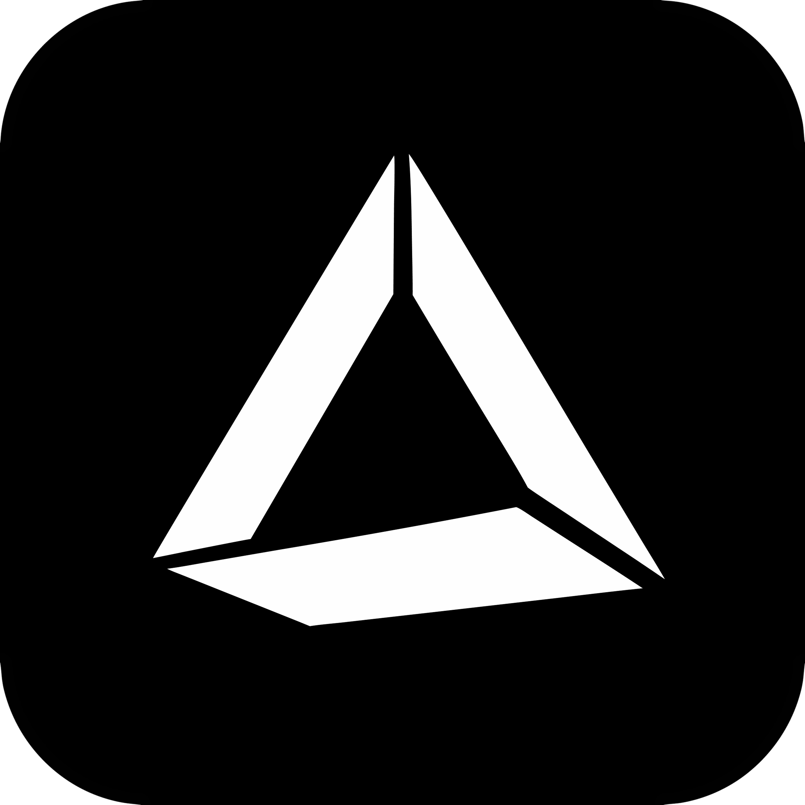
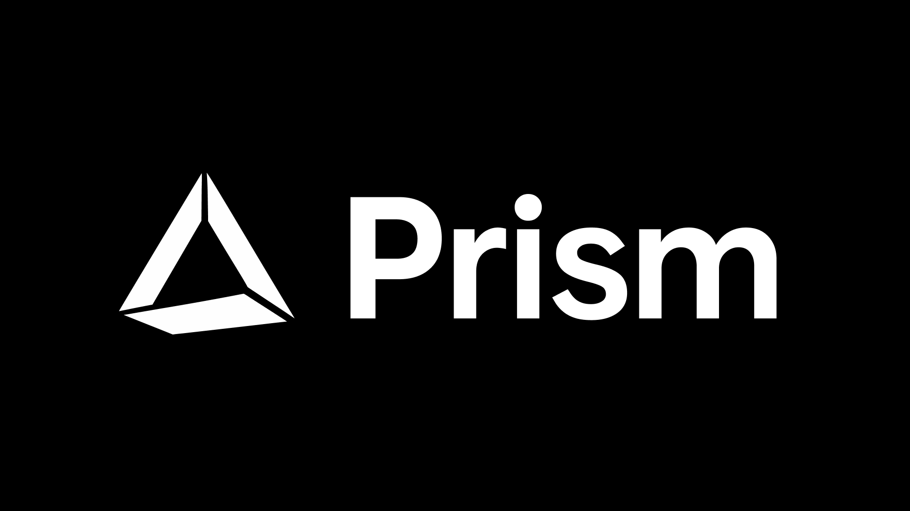

<div align="center">



# Prism

### One proxy. Every agent. Every protocol. A 5 MB binary with zero dependencies. Runs on Windows & macOS.

Prism is a universal LLM proxy that connects any AI agent — Claude Code, Codex Desktop, Factory Droid, OpenCode, ZCode, Cursor, and more — to any provider through any protocol. It translates between Anthropic Messages, OpenAI Chat Completions, OpenAI Responses, and Ollama APIs in real time, with built-in one-click integrations that auto-configure your agents. Native system tray, web admin UI, model auto-discovery, and full SSE streaming. Zero config.

[](https://github.com/user/prism)
[](https://github.com/user/prism)
[](https://go.dev/)
[]()



</div>

---

## Why Prism?

Every AI agent speaks a different protocol. Every provider expects a different format. Every model has different capabilities. Prism sits in between, translating requests and responses on the fly — and with one-click integrations, it auto-configures your agents so they just work.

**One proxy. Every agent. Every protocol. No Python.**

| | Prism | LiteLLM |
|---|---|---|
| **Binary size** | ~5 MB | ~200 MB (Python + deps) |
| **Memory** | ~5–10 MB | ~200–500 MB |
| **Startup** | < 100 ms | ~2–5 s |
| **Runtime deps** | None | Python 3.9+, pip packages |
| **Anthropic API** | ✅ | ✅ |
| **OpenAI Chat API** | ✅ | ✅ |
| **OpenAI Responses API** | ✅ | ❌ |
| **Ollama Native API** | ✅ | ✅ |
| **Streaming (SSE)** | ✅ | ✅ |
| **Model remapping** | ✅ | ✅ |
| **Tool calling** | ✅ | ✅ |
| **Thinking/reasoning** | ✅ | ⚠️ partial |
| **Per-model reasoning toggle** | ✅ | ❌ |
| **Reasoning effort validation** | ✅ | ❌ |
| **Image support** | ✅ | ✅ |
| **Structured outputs** | ✅ | ⚠️ partial |
| **Per-model capabilities** | ✅ Tools / Vision / Struct | ❌ |
| **Auto model config (models.dev)** | ✅ Zero-config | ❌ |
| **Provider-per-model routing** | ✅ | ❌ |
| **Claude Code integration** | ✅ One-click | ❌ |
| **Codex Desktop & CLI integration** | ✅ One-click | ❌ |
| **Factory Droid integration** | ✅ One-click | ❌ |
| **OpenCode integration** | ✅ One-click | ❌ |
| **ZCode integration** | ✅ One-click | ❌ |
| **Web admin UI** | ✅ | ❌ |
| **Windows native** | ✅ System tray + admin UI | ❌ Requires Python |
| **macOS native** | ✅ System tray + admin UI | ❌ Requires Python |

## How it works

```
  Your agents                              Cloud providers
  ─────────                               ────────────────

  Claude Code ─────┐
  (Anthropic API)  │                       ┌──────────────┐
                   │    ┌───────────┐       │  Ollama Cloud │
  Codex Desktop ───┼───→│   Prism   │──────→│  /api/chat    │
  (Responses API)  │    │  :11434   │       └──────────────┘
                   │    └───────────┘       ┌──────────────┐
  Factory Droid ───┤         │              │  OpenCode Go  │
  (Chat Completions)│         │              │  /v1/chat/... │
                   │         │              └──────────────┘
  OpenCode ────────┤         │              ┌──────────────┐
  (Chat Completions)│         ├──────────────→│  Custom       │
                   │         │              │  /v1/chat/... │
  ZCode ───────────┤         │              └──────────────┘
  (Chat Completions)│         │
                   │         │              ┌────────────────────┐
  Cursor ──────────┤         └──────────────→│  Codex (via OAuth) │
  (OpenAI API)     │                        │  /backend-api/...  │
                   │                        └────────────────────┘
  Continue ────────┤
  (OpenAI API)     │              ┌────────────────────┐
                   │              │  Codex (via OAuth) │── Sign in with OpenAI
  OpenAI SDK ──────┘              │  /backend-api/...  │   account — no API key
  (Responses API)                 └────────────────────┘   needed

                            ┌────────────────────┐
                            │  Admin UI          │
                            │  :8765             │
                            └────────────────────┘
```

Prism accepts requests in **four protocol formats** — **Anthropic Messages** (`/v1/messages`), **OpenAI Chat Completions** (`/v1/chat/completions`), **OpenAI Responses** (`/v1/responses`), and **Ollama Native** (`/api/chat`) — translates them to whatever your upstream provider speaks, and translates responses back. For Codex (OpenAI) accounts, Prism routes directly to the ChatGPT backend API, including Chat Completions ↔ Responses API translation so any agent can use your OAuth account regardless of its protocol. Streaming works seamlessly in all directions.

For integrated agents, Prism writes the right config files automatically — environment variables, provider blocks, model catalogs — so your agents see Prism's models without any manual setup.

## Quick start

### 1. Run Prism

**Windows:**
```powershell
./prism.exe
```

**macOS:**
```bash
open Prism.app
# or from the DMG: drag Prism.app to /Applications, then open it
```

That's it. Prism starts on `http://127.0.0.1:11434` and a system tray icon appears. A web admin UI is available at `http://127.0.0.1:8765/admin`.

### 2. Configure your provider

Open the admin UI from the system tray (right-click → **Open Settings**) or navigate to `http://127.0.0.1:8765/admin`. In the **Provider** tab:

1. Select your upstream provider (Ollama Cloud, OpenCode Go, a custom provider, or a Codex OAuth account)
2. For API-key providers, enter your API key
3. For Codex, click **Add Codex Account** to sign in with your OpenAI account
4. Prism auto-restarts with the new config

You can also configure via the config file — `%APPDATA%\prism\config.json` on Windows or `~/Library/Application Support/prism/config.json` on macOS — see [Providers](#providers) below.

### 3. Add your models

In the **Models** tab, just type a model name and Prism auto-fetches all the details — context length, max output tokens, reasoning support, tool calling, vision, structured outputs, and reasoning effort levels — from [models.dev](https://models.dev). No manual configuration needed. Select your provider, search for the model, and click to auto-fill everything.

### 4. Connect your agents

Go to the **Agents** tab in the admin UI. Prism auto-detects which agents are installed and shows their status. Click **Setup** next to any agent to configure it with one click. See [Agent integrations](#agent-integrations) for details on each agent.

<details>
<summary><strong>Setting up with Claude Desktop</strong></summary>

Edit your Claude Desktop config:

```json
{
  "inferenceProvider": "gateway",
  "inferenceGatewayBaseUrl": "http://127.0.0.1:11434",
  "inferenceGatewayApiKey": "prism",
  "inferenceModels": [
    { "name": "glm-5.1:cloud" },
    { "name": "deepseek-v4-pro:cloud", "supports1m": true }
  ]
}
```

</details>

<details>
<summary><strong>Setting up with Claude Code</strong></summary>

Prism integrates with Claude Code by setting environment variables and per-tier model mappings in `~/.claude/settings.json`. You can choose which Prism model fills each tier (opus, sonnet, haiku, subagent).

**One-click setup:** Go to the **Agents** tab in the admin UI, select your tier models, and click **Setup**. Prism backs up your existing config and writes the right environment variables.

**Manual setup:** Edit `~/.claude/settings.json`:

```json
{
  "env": {
    "ANTHROPIC_BASE_URL": "http://127.0.0.1:11434",
    "ANTHROPIC_AUTH_TOKEN": "prism",
    "ANTHROPIC_API_KEY": ""
  }
}
```

</details>

<details>
<summary><strong>Setting up with Codex Desktop & CLI</strong></summary>

Prism integrates with Codex Desktop and Codex CLI's native model selector. When enabled, all your Prism models appear directly in the model picker — no need to manually configure each model.

**One-click setup:** Go to the **Agents** tab in the admin UI and click **Setup** under "Codex Desktop Integration".

**How it works:** Prism writes a managed provider block to `~/.codex/config.toml` and generates a model catalog JSON file. Codex Desktop/CLI reads these on launch and populates its model picker with your Prism models. Requests flow through Prism's Responses API endpoint, which translates them to your configured upstream provider.

**Automatic sync:** Prism auto-syncs the catalog on every startup if Codex Desktop/CLI is detected (`~/.codex/config.toml` exists), so new models added to your remapping are picked up automatically.

**To disable:** Click **Restore** in the Agents tab. This removes Prism's managed blocks and restores any previous settings.

</details>

<details>
<summary><strong>Setting up with Factory Droid</strong></summary>

Prism adds your models as `[Prism]` custom entries in `~/.factory/settings.json`. Codex OAuth models are routed through `/v1/responses`, all others through `/v1/chat/completions`.

**One-click setup:** Go to the **Agents** tab in the admin UI and click **Setup** under "Factory Droid". Prism backs up your existing config and injects all your Prism models.

**To disable:** Click **Restore** to remove all Prism-tagged entries.

</details>

<details>
<summary><strong>Setting up with OpenCode</strong></summary>

Prism registers two providers in `~/.config/opencode/opencode.json`: `prism` (for non-Codex models via `/v1/chat/completions`) and `prism-codex` (for Codex OAuth models via `/v1/responses`). The first available Prism model is set as the default.

**One-click setup:** Go to the **Agents** tab in the admin UI and click **Setup** under "OpenCode". Prism backs up your existing config and writes the provider blocks.

**To disable:** Click **Restore** to remove the Prism providers and default model references.

</details>

<details>
<summary><strong>Setting up with ZCode</strong></summary>

Prism writes a provider block to `~/.zcode/v2/config.json` with your Prism base URL and API key. Each model entry includes context/output limits, modalities, and optional reasoning configuration.

**One-click setup:** Go to the **Agents** tab in the admin UI and click **Setup** under "ZCode". Prism backs up your existing config and writes the provider block.

**To disable:** Click **Restore** to remove the Prism provider.

</details>

<details>
<summary><strong>Setting up with Cursor / Continue / other OpenAI clients</strong></summary>

Point your client to `http://127.0.0.1:11434/v1` with any API key. Prism accepts OpenAI Chat Completions requests and translates them to the configured upstream provider.

</details>

<details>
<summary><strong>Setting up with OpenAI SDK (Responses API)</strong></summary>

Set the base URL to `http://127.0.0.1:11434/v1`. Prism accepts OpenAI Responses API requests at `/v1/responses` and translates them to the configured upstream provider — including streaming, tool calls, and reasoning.

```python
from openai import OpenAI

client = OpenAI(
    base_url="http://127.0.0.1:11434/v1",
    api_key="prism"
)

response = client.responses.create(
    model="glm-5.1:cloud",
    input="Hello!",
    stream=True
)
```

</details>

## Agent integrations

Prism includes built-in, one-click integrations for popular AI coding agents. Each integration auto-detects whether the agent is installed, writes the right config files, and keeps them in sync when your models change.

| Agent | What it does | Config location |
|---|---|---|
| **Claude Code** | Sets `ANTHROPIC_BASE_URL` + per-tier model mappings | `~/.claude/settings.json` |
| **Codex Desktop & CLI** | Injects models into native model picker | `~/.codex/config.toml` + catalog JSON |
| **Factory Droid** | Adds `[Prism]` custom models with smart routing | `~/.factory/settings.json` |
| **OpenCode** | Registers `prism` + `prism-codex` providers | `~/.config/opencode/opencode.json` |
| **ZCode** | Registers `prism` provider with model list | `~/.zcode/v2/config.json` |

**How it works:**

1. **Auto-detection** — Prism checks if each agent's config file or binary exists on disk. The Agents tab shows which agents are installed and active.
2. **One-click setup** — Click **Setup** to back up the agent's existing config and write Prism's configuration. Click **Restore** to revert to the backup.
3. **Auto-sync** — Prism syncs all agent configs on startup and whenever you add or remove models, so newly added models appear automatically.
4. **Smart routing** — Codex OAuth models are routed through `/v1/responses`, all others through `/v1/chat/completions`. Each agent gets the right endpoint for its protocol.

## System tray

When launched without arguments, Prism runs as a system tray application with these options:

| Menu item | Action |
|---|---|
| **Start / Stop / Restart Proxy** | Control the proxy server process |
| **SearXNG: Running / Stopped** | Live status of the managed SearXNG instance |
| **Start / Stop / Restart SearXNG** | Control the managed SearXNG metasearch instance |
| **Open Settings** | Open the web admin UI in your browser |
| **Open Folder** | Open the proxy directory in Explorer / Finder |
| **Edit Model Config** | Open `model_remapping.json` in Notepad / TextEdit |
| **Show Logs** | Open a live log viewer console |
| **Check for Updates** | Check for newer versions of Prism |
| **Quit** | Stop proxy and SearXNG, then exit |

## Admin Web UI

Prism includes a built-in web admin interface for managing everything without editing config files by hand.

**URL:** `http://127.0.0.1:8765/admin` (configurable via `PRISM_ADMIN_PORT`)

The admin UI provides:

| Tab | Features |
|---|---|
| **Provider** | Select default provider, set API keys, add/edit/remove custom providers |
| **OAuth** | Manage Codex (OpenAI) accounts — sign in, view session/weekly usage percentages, activate, or remove accounts |
| **Models** | Edit model remapping — default model, known models with per-model provider, reasoning toggle, capabilities (tools/vision/struct), context length, max output tokens, reasoning effort levels, and aliases. **Auto-fill from models.dev** — type a model name, search, and click to populate all fields automatically. |
| **Agents** | One-click setup/restore for Claude Code, Codex Desktop, Factory Droid, OpenCode, and ZCode. Claude Code includes per-tier model selectors (opus, sonnet, haiku, subagent). |
| **Stats** | Live and historical performance dashboard (see below) |
| **Proxy** | Start, stop, and restart the proxy; view status; toggle auto-start at login |
| **SearXNG** | Start, stop, and restart the managed SearXNG metasearch instance; toggle auto-start on Prism launch; structured editor for the user-tunable subset of `settings.yml` (server / search / UI). First Start bootstraps an isolated Python venv and installs SearXNG (~80 MB); if no system Python ≥3.11 is found, Prism downloads a [python-build-standalone](https://github.com/astral-sh/python-build-standalone) interpreter (≥3.11) first. |
| **Logs** | Live tail of the last 200 log lines |

Changes are saved immediately and the proxy auto-restarts when needed.

### Stats Dashboard

The **Stats** tab surfaces every metric about your proxy usage:

| Section | What it shows |
|---|---|
| **Filter bar** | Filter by provider, model, **client origin**, or date range; refresh button to reload all data |
| **Tokens Per Day** | Stacked bar chart (input + output) with a total headline — persists across restarts via SQLite |
| **Tokens Per Month** | Filled line chart showing monthly aggregate totals |
| **Live TPS** | Real-time tokens/sec hero value with a live sparkline chart (120-point rolling window, updated every second) |
| **Session Totals** | Running counts: total requests, input tokens, output tokens, and average TPS |
| **Client Breakdown** | Per-client usage stats showing requests, total tokens, and a distribution pie chart — identifies tools like Claude Code, Cursor, Continue, Copilot, Factory Droid, and more automatically by User-Agent |
| **TPS History** | Table (model, provider, avg/max TPS) paired with a multi-line chart of 5-minute bucket averages over time |
| **By Model** | Per-model breakdown of requests, token counts, and average TPS |
| **Recent Requests** | Timestamped log of the last 50 requests with model, client, token counts, TPS, and duration |
| **Data Management** | One-click **Clear All Stats** button to wipe all persisted history |

All request data and TPS snapshots are persisted to the stats database (`%APPDATA%\prism\stats.db` on Windows, `~/Library/Application Support/prism/stats.db` on macOS — SQLite, WAL mode) so the dashboard survives proxy restarts and page refreshes. Charts are rendered with Chart.js and automatically adapt to light/dark theme.

### Client detection

Prism automatically identifies which tool is making each request by inspecting the `User-Agent` header. Detected clients include:

**Claude Code, Cursor, Continue, GitHub Copilot, Aider, OpenCode, Windsurf, Trae, Factory Droid, Supermaven, and Claude Desktop.**

You can override detection by setting the `X-Client-Name` header on your requests — the value is used directly in stats, so you can tag requests with custom names like `"my-script"` or `"ci-pipeline"`.

## Environment variables

| Variable | Default | Description |
|---|---|---|
| `PRISM_PORT` | `11434` | Port for the proxy server |
| `PRISM_HOST` | `127.0.0.1` | Host to bind (use `0.0.0.0` for network access) |
| `PRISM_ADMIN_PORT` | `8765` | Port for the admin web UI |
| `OLLAMA_API_KEY` | — | API key for Ollama Cloud (fallback if not in config) |
| `OPENCODE_GO_API_KEY` | — | API key for OpenCode Go (fallback if not in config) |

## Providers

Prism supports multiple upstream providers, configured via the admin UI or the config file (`%APPDATA%\prism\config.json` on Windows, `~/Library/Application Support/prism/config.json` on macOS):

| Provider | Config key | Upstream format | Endpoint |
|---|---|---|---|
| **Ollama Cloud** | `ollama_cloud` | Ollama Native | `/api/chat` |
| **OpenCode Go** | `opencode_go` | OpenAI | `/v1/chat/completions` |
| **Custom providers** | `custom_providers[]` | OpenAI | `/v1/chat/completions` |
| **Codex (via OAuth)** | `oauth_accounts[]` | OpenAI | `chatgpt.com/backend-api/codex/responses` |

### Provider-per-model routing

Each model in your remapping is assigned to a specific provider. When a request arrives, Prism resolves the model, looks up its assigned provider, and routes the request to that upstream — even if other models go to different providers. This means you can mix models from Ollama Cloud, OpenCode Go, custom providers, and OAuth accounts in a single session.

- The `default_provider` field in config is used only as a fallback when a model has no explicit provider assignment.
- Provider routing is handled by the **ProviderRouter**, which resolves the provider per-request based on the requested model name.
- Models from different providers can coexist — set each model's provider when adding it to **Known Models**.

### Custom providers

You can add multiple custom providers (e.g. OpenRouter, Groq, Together AI) — each with its own name, base URL, and API key. Add, edit, or delete them from the admin UI **Provider** tab. Custom providers are assigned unique IDs like `custom_myprovider_abc123`.

### Codex OAuth accounts

Prism supports signing in with your OpenAI account via OAuth (no API key needed). Click **Add Codex Account** in the admin UI **OAuth** tab or system tray, and your browser will open for authentication. Once connected, Prism uses your account token automatically, including token refresh and usage tracking.

Codex requests route directly to `chatgpt.com/backend-api/codex/responses` — not through `api.openai.com` — which avoids Cloudflare restrictions on bearer tokens. Prism also extracts the `chatgpt-account-id` from your JWT token automatically, so you don't need to configure it manually.

Switch providers from the system tray, admin UI, or by changing the `default_provider` field — no restart required when using the tray/UI.

<details>
<summary><strong>Full config example</strong></summary>

```json
{
  "default_provider": "ollama_cloud",
  "ollama_cloud": {
    "id": "ollama_cloud",
    "name": "Ollama Cloud",
    "base_url": "https://ollama.com",
    "api_key": ""
  },
  "opencode_go": {
    "id": "opencode_go",
    "name": "OpenCode Go",
    "base_url": "https://opencode.ai/zen/go",
    "api_key": ""
  },
  "custom_providers": [
    {
      "id": "custom_openrouter_abc123",
      "name": "OpenRouter",
      "base_url": "https://openrouter.ai/api/v1",
      "api_key": ""
    }
  ],
  "oauth_accounts": [
    {
      "id": "codex_user_abc123",
      "provider": "codex",
      "label": "Codex",
      "email": "user@example.com",
      "access_token": "...",
      "refresh_token": "...",
      "expires_at": 1234567890,
      "plan_tier": "plus",
      "active": true
    }
  ],
  "agent_integrations": {
    "claude_code_tiers": {
      "opus": "deepseek-v4-pro:cloud",
      "sonnet": "deepseek-v4-flash:cloud",
      "haiku": "glm-5.1:cloud",
      "subagent": "deepseek-v4-flash:cloud"
    }
  }
}
```

API keys in the config file take priority. If empty, Prism falls back to these environment variables:

| Variable | Used for |
|---|---|
| `OLLAMA_API_KEY` | Ollama Cloud |
| `OPENCODE_GO_API_KEY` | OpenCode Go |

</details>

## Model remapping

Prism can remap model names on the fly — useful when clients send model names that don't exist on your upstream provider.

Configured via the admin UI (**Models** tab) or the model remapping file (`%APPDATA%\prism\model_remapping.json` on Windows, `~/Library/Application Support/prism/model_remapping.json` on macOS).

### Auto model configuration

Instead of manually filling in context lengths, token limits, and capabilities, just type a model name in the **Models** tab and click **Search**. Prism queries [models.dev](https://models.dev) and auto-fills:

- Context length
- Max output tokens
- Reasoning toggle and allowed effort levels
- Tool calling, structured output, and vision capabilities

The search is scoped to your selected provider so you get accurate results. No manual configuration needed — search, select, and you're done.

### Default model

When an unknown model is requested, Prism falls back to this model. Select it from the dropdown in the admin UI or set `default_model`.

### Known models

Known models are rich entries — not just strings — with per-model provider assignment, reasoning toggle, capabilities, and token limits. Each entry includes:

| Field | Type | Description |
|---|---|---|
| `id` | string | Model identifier (e.g. `deepseek-v4-flash:cloud`) |
| `provider` | string | Provider to route this model to (e.g. `ollama_cloud`, `opencode_go`, a custom provider ID, or an OAuth account ID) |
| `reasoning` | bool | Whether this model supports thinking/reasoning |
| `reasoning_effort` | string[] | Allowed reasoning effort levels (`low`, `medium`, `high`, `max`) |
| `context_length` | int | Maximum context window in tokens |
| `max_output_tokens` | int | Maximum output tokens |
| `capabilities.tool_calling` | bool | Supports tool/function calling |
| `capabilities.structured_outputs` | bool | Supports structured/JSON output |
| `capabilities.vision` | bool | Supports image input |

Models matching a known entry pass through without remapping. A model that doesn't match any entry falls back to the default model.

### Reasoning toggle & effort validation

Prism validates `reasoning_effort` against each model's capabilities:

- **Non-reasoning models**: `reasoning_effort` is automatically stripped from requests.
- **Reasoning models**: Invalid effort values are normalized to the model's first allowed effort (e.g. `"invalid"` → `"medium"`), with a warning logged.
- **Unknown models**: `reasoning_effort` is stripped for safety.
- **Responses API normalization**: `enabled` / `on` / `true` → `medium`; `disabled` / `off` / `false` / `none` → omitted.
- **Anthropic → OpenAI translation**: Anthropic `thinking` is mapped to `reasoning_effort=medium`.

### Model aliases

Map incoming model names to different upstream models.

| Feature | What it does |
|---|---|
| **Aliases** | Map model names (e.g. `claude-3-5-haiku` → `deepseek-v4-flash:cloud`) |
| **Default model** | Fallback when a requested model isn't recognized |
| **Known models** | Rich entries with per-model provider, reasoning, and capabilities |
| **Auto config** | Search models.dev and auto-fill all fields |

<details>
<summary><strong>Full remapping example</strong></summary>

```json
{
  "default_model": "glm-5.1:cloud",
  "known_models": [
    {
      "id": "glm-5.1:cloud",
      "provider": "ollama_cloud",
      "reasoning": true,
      "reasoning_effort": ["low", "medium", "high"],
      "context_length": 128000,
      "max_output_tokens": 16384,
      "capabilities": {
        "tool_calling": true,
        "structured_outputs": true,
        "vision": true
      }
    },
    {
      "id": "deepseek-v4-flash:cloud",
      "provider": "ollama_cloud",
      "reasoning": true,
      "reasoning_effort": ["low", "medium", "high"],
      "context_length": 128000,
      "max_output_tokens": 16384,
      "capabilities": {
        "tool_calling": true,
        "structured_outputs": true
      }
    },
    {
      "id": "opencode/deepseek-v4-flash",
      "provider": "opencode_go",
      "reasoning": true,
      "reasoning_effort": ["low", "medium", "high"],
      "context_length": 128000,
      "max_output_tokens": 16384,
      "capabilities": {
        "tool_calling": true,
        "structured_outputs": true
      }
    },
    {
      "id": "deepseek-v4-pro:cloud",
      "provider": "ollama_cloud",
      "reasoning": true,
      "reasoning_effort": ["low", "medium", "high", "max"],
      "context_length": 128000,
      "max_output_tokens": 16384,
      "capabilities": {
        "tool_calling": true,
        "structured_outputs": true
      }
    }
  ],
  "aliases": {
    "claude-3-5-haiku": "deepseek-v4-flash:cloud",
    "claude-3-5-haiku-20241022": "deepseek-v4-flash:cloud",
    "claude-3-haiku-20240307": "deepseek-v4-flash:cloud",
    "claude-haiku-3-5-20241022": "deepseek-v4-flash:cloud"
  }
}
```

</details>

## API endpoints

| Method | Path | Auth | Description |
|---|---|---|---|
| `POST` | `/v1/messages` | `x-api-key` header | Anthropic Messages API |
| `POST` | `/v1/chat/completions` | `Authorization: Bearer <key>` | OpenAI Chat Completions API |
| `POST` | `/v1/responses` | `Authorization: Bearer <key>` | OpenAI Responses API |
| `GET` | `/v1/models` | `Authorization: Bearer <key>` | List available models |
| `GET` | `/health` | None | Health check |
| `GET` | `/api/model-info` | None | Look up model details from models.dev (admin UI) |
| `GET` | `/admin/model-info` | None | Look up model details from models.dev (admin server only) |
| `GET` | `/admin/model-search` | None | Search models on models.dev (admin server only) |
| `POST` | `/v1/messages/count_tokens` | `x-api-key` header | Returns 404 (not supported upstream) |

## Translation support

Prism handles the full translation surface between all API formats:

<details>
<summary><strong>Anthropic ↔ Ollama</strong></summary>

**Request mapping:**

| Anthropic | Ollama | Notes |
|---|---|---|
| `messages` | `messages` | Content blocks → string or array |
| `system` | `messages[].role=system` | Injected as first message |
| `max_tokens` | `options.num_predict` | |
| `temperature` / `top_p` / `top_k` | `options.*` | |
| `tools` | `tools` | Schema translation |
| `thinking` | `think` | |
| `stop_sequences` | `options.stop` | |
| `images` (base64) | `images` | Image content blocks → image array |

**Response mapping:**

| Ollama | Anthropic | Notes |
|---|---|---|
| `message.content` | `content[0].text` | Wrapped in content block array |
| `message.tool_calls` | `content[].tool_use` | |
| `message.thinking` | `content[].thinking` | |
| `done_reason: stop` | `stop_reason: end_turn` | |
| `done_reason: length` | `stop_reason: max_tokens` | |
| `done_reason: tool_call` | `stop_reason: tool_use` | |

</details>

<details>
<summary><strong>Anthropic ↔ OpenAI</strong></summary>

**Request mapping:**

| Anthropic | OpenAI | Notes |
|---|---|---|
| `messages` | `messages` | Content blocks → OpenAI format |
| `system` | `messages[].role=system` | |
| `max_tokens` | `max_tokens` | |
| `tools` | `tools` | Schema translation |
| `thinking` | `reasoning_content` | |
| `images` (base64) | `image_url` (data URI) | Image content blocks → OpenAI image parts |

**Response mapping:**

| OpenAI | Anthropic | Notes |
|---|---|---|
| `choices[0].message.content` | `content[0].text` | |
| `choices[0].message.tool_calls` | `content[].tool_use` | |
| `choices[0].message.reasoning_content` | `content[].thinking` | |
| `finish_reason: stop` | `stop_reason: end_turn` | |
| `finish_reason: length` | `stop_reason: max_tokens` | |
| `finish_reason: tool_calls` | `stop_reason: tool_use` | |

</details>

<details>
<summary><strong>OpenAI inbound → Ollama</strong></summary>

When an OpenAI client talks to Prism with an Ollama upstream, Prism translates the full OpenAI Chat Completions request/response format to/from Ollama native format — including streaming, tool calls, reasoning content, and images.

| OpenAI | Ollama | Notes |
|---|---|---|
| `reasoning_effort` | `think` | Any non-"off" value enables thinking |
| `image_url` (data URI) | `images` | Base64 data extracted from data URI |
| `response_format` | — | Passed through when supported |

</details>

<details>
<summary><strong>OpenAI inbound → OpenAI (pass-through)</strong></summary>

When both the client and upstream speak OpenAI format, Prism applies model remapping and forwards the request with minimal modification. Streaming is passed through as-is.

</details>

<details>
<summary><strong>Responses API ↔ Ollama / OpenAI</strong></summary>

Prism translates the OpenAI Responses API (`/v1/responses`) to the upstream format, whether Ollama or OpenAI:

| Responses API | Chat Completions / Ollama | Notes |
|---|---|---|
| `input` (string) | `messages[].role=user` | Simple string input → user message |
| `input` (array of items) | `messages[]` | `message`, `function_call`, `function_call_output`, `custom_tool_call_output` items mapped |
| `instructions` | `messages[].role=system` | System prompt |
| `tools` (function type) | `tools` | `type: function` tools forwarded as-is |
| `tools` (built-in type) | `tools` | Codex built-in tools (apply_patch, local_shell, web_search, etc.) rewrapped as function tools with preserved type mapping |
| `reasoning` | `reasoning_effort` / `think` | Reasoning config → thinking mode |
| `text.format` | `response_format` / `format` | Structured output / JSON schema |
| `max_output_tokens` | `max_tokens` / `options.num_predict` | |
| `temperature` / `top_p` | `temperature` / `top_p` | |

**Response mapping (OpenAI upstream → Responses API):**

| Chat Completions | Responses API | Notes |
|---|---|---|
| `message.content` | `output[].message.content[].output_text` | Text content → output parts |
| `message.reasoning_content` | `output[].reasoning` | Reasoning → reasoning item |
| `message.tool_calls` | `output[].function_call` or `output[].custom_tool_call` | Tool calls mapped back to correct output type |
| `finish_reason: stop` | `status: completed` | |
| `finish_reason: length` | `status: incomplete` | |

**Built-in tool type preservation:** Prism maps Codex built-in tools (apply_patch, local_shell, web_search, computer_use) to function tools for the upstream model, preserving the original type so responses translate back correctly — e.g., `apply_patch` → `custom_tool_call` with `input` field instead of `arguments`.

**Streaming:** Full Responses API streaming event sequence is emitted — `response.created`, `response.output_item.added`, `response.output_text.delta`, `response.output_text.done`, `response.content_part.added/done`, `response.output_item.done`, `response.function_call_arguments.delta/done`, `response.custom_tool_call_input.done`, and `response.completed`.

</details>

<details>
<summary><strong>Codex OAuth direct passthrough</strong></summary>

For Codex (OpenAI) OAuth accounts, Prism routes Responses API requests directly to `chatgpt.com/backend-api/codex/responses` — bypassing `api.openai.com` entirely. This avoids Cloudflare restrictions on bearer tokens and provides native Codex tool support.

For Chat Completions clients (like Factory Droid, OpenCode) that need to reach Codex, Prism translates Chat Completions → Responses API format before forwarding to the Codex backend, so any agent can use your OAuth account regardless of its protocol.

Prism automatically extracts the `chatgpt-account-id` from your JWT token and includes it as a header, so no manual configuration is needed.

</details>

## Streaming

All routing paths support real-time SSE streaming with correct event translation:

| Inbound | Upstream | Streaming |
|---|---|---|
| Anthropic | Ollama | ✅ Newline-delimited JSON → Anthropic SSE |
| Anthropic | OpenAI | ✅ OpenAI SSE → Anthropic SSE |
| OpenAI Chat | Ollama | ✅ Newline-delimited JSON → OpenAI SSE |
| OpenAI Chat | OpenAI | ✅ Pass-through with model remapping |
| OpenAI Chat | Codex (OAuth) | ✅ Chat Completions → Codex Responses SSE |
| OpenAI Responses | Ollama | ✅ Newline-delimited JSON → Responses API SSE events |
| OpenAI Responses | OpenAI | ✅ OpenAI SSE → Responses API SSE events |
| OpenAI Responses | Codex (OAuth) | ✅ Direct passthrough to Codex backend |

Thinking/reasoning blocks, tool calls, and images are fully supported in all streaming paths.

## Auto-start at Login

Prism can start automatically when you log in. Toggle this from the admin UI (**Proxy** tab → **Start at Login**).

**Windows:** Uses the Windows Registry (`HKCU\Software\Microsoft\Windows\CurrentVersion\Run`) to launch the Prism executable at login. No admin rights required.

**macOS:** Uses a LaunchAgent plist (`~/Library/LaunchAgents/com.prism.plist`) to launch Prism at login.

## SearXNG

Prism can run a local [SearXNG](https://github.com/searxng/searxng) metasearch engine as a managed instance, controlled from the system tray and the admin UI **SearXNG** tab. It runs as a separate process from the proxy (default `http://127.0.0.1:8888/`); the proxy port (`11434`) is unchanged.

**First Start** bootstraps an isolated Python venv and `pip install`s SearXNG (~80 MB, a minute or two). SearXNG requires Python ≥3.11 (it imports the stdlib `tomllib` module). If no system Python ≥3.11 is found on PATH, Prism downloads a matching [python-build-standalone](https://github.com/astral-sh/python-build-standalone) interpreter (≥3.11) first — so SearXNG runs on machines with no Python installed at all. On Windows, Prism also applies an idempotent patch that makes SearXNG's unconditional `pwd` import conditional, so the webapp launches cleanly.

The generated `settings.yml` inherits SearXNG's full engine set (`use_default_settings`), enables JSON output, and turns the bot limiter **off** — so no Valkey/Redis is required for local single-user use.

| Control | Where |
|---|---|
| Start / Stop / Restart | System tray **SearXNG** menu, or admin UI **SearXNG** tab |
| Auto-start on Prism launch | Admin UI **SearXNG** tab (only triggers if SearXNG is already installed — the first-time download never runs automatically) |
| Structured settings (server / search / UI) | Admin UI **SearXNG** tab → **Settings** card; changes require a Restart to take effect |
| Advanced settings (engines, outgoing, redis) | Edit `settings.yml` directly |

Everything lives under Prism's config dir — `%APPDATA%\prism\searxng\` on Windows, `~/Library/Application Support/prism/searxng/` on macOS (venv, source tree, and `settings.yml`). Deleting that directory or uninstalling Prism removes it completely.

## Limitations

The following features are not supported by upstream providers and are handled gracefully:

- **Anthropic**: `count_tokens`, `tool_choice`, `metadata`, prompt caching, batches, PDF, URL images
- **OpenAI Chat inbound**: `/v1/models` returns a static list from config (not proxied), `parallel_tool_calls`, `logprobs`, `seed`, `user`
- **OpenAI Responses inbound**: `previous_response_id` (conversation continuity), `store`, built-in tools (web search, file search, code interpreter) are filtered out for Ollama upstreams

## Building from source

**Windows:**
```powershell
go-winres make; go build -ldflags="-H windowsgui" -o prism.exe .
```

The `-H windowsgui` flag hides the console window and enables system tray integration.

To run in console mode (for debugging), build without the flag:
```powershell
go build -o prism.exe .
./prism.exe --serve
```

**macOS:**
```bash
CGO_ENABLED=1 go build -ldflags="-X main.version=dev" -o prism .
# Or use the build script to create a signed .app bundle and DMG:
./scripts/build-darwin.sh
```

## Verification

**Windows (PowerShell):**
```powershell
# 1. Start Prism
./prism.exe

# 2. Test Anthropic endpoint
Invoke-RestMethod -Uri "http://127.0.0.1:11434/v1/messages" -Method POST `
  -ContentType "application/json" `
  -Headers @{"x-api-key"="prism"} `
  -Body '{"model":"glm-5.1:cloud","max_tokens":50,"messages":[{"role":"user","content":"hi"}]}'

# 3. Test OpenAI Chat Completions endpoint
Invoke-RestMethod -Uri "http://127.0.0.1:11434/v1/chat/completions" -Method POST `
  -ContentType "application/json" `
  -Headers @{"Authorization"="Bearer prism"} `
  -Body '{"model":"glm-5.1:cloud","max_tokens":50,"messages":[{"role":"user","content":"hi"}]}'

# 4. Test OpenAI Responses API endpoint
Invoke-RestMethod -Uri "http://127.0.0.1:11434/v1/responses" -Method POST `
  -ContentType "application/json" `
  -Headers @{"Authorization"="Bearer prism"} `
  -Body '{"model":"glm-5.1:cloud","input":"hi"}'

# 5. Test model listing
Invoke-RestMethod -Uri "http://127.0.0.1:11434/v1/models" -Headers @{"Authorization"="Bearer prism"}

# 6. Test admin UI
Invoke-RestMethod -Uri "http://127.0.0.1:8765/admin/status"
```

**macOS / Linux (bash):**
```bash
# 1. Start Prism
open Prism.app

# 2. Test Anthropic endpoint
curl -s http://127.0.0.1:11434/v1/messages \
  -H "x-api-key: prism" \
  -H "Content-Type: application/json" \
  -d '{"model":"glm-5.1:cloud","max_tokens":50,"messages":[{"role":"user","content":"hi"}]}'

# 3. Test OpenAI Chat Completions endpoint
curl -s http://127.0.0.1:11434/v1/chat/completions \
  -H "Authorization: Bearer prism" \
  -H "Content-Type: application/json" \
  -d '{"model":"glm-5.1:cloud","max_tokens":50,"messages":[{"role":"user","content":"hi"}]}'

# 4. Test OpenAI Responses API endpoint
curl -s http://127.0.0.1:11434/v1/responses \
  -H "Authorization: Bearer prism" \
  -H "Content-Type: application/json" \
  -d '{"model":"glm-5.1:cloud","input":"hi"}'

# 5. Test model listing
curl -s http://127.0.0.1:11434/v1/models -H "Authorization: Bearer prism"

# 6. Test admin UI
curl -s http://127.0.0.1:8765/admin/status
```

---

### Acknowledgments

The **Codex Desktop & CLI integration** (native model selector support) was inspired by and reverse-engineered from [codex-shim](https://github.com/sybil-solutions/codex-shim) by [Sybil Solutions](https://github.com/sybil-solutions). Their work on the Responses API translation layer, `custom_model_catalog.json` format, `config.toml` managed blocks, and the ASAR patch for the model picker provided the blueprint for Prism's Codex support. If you need a standalone Python-based shim with additional features (Cursor passthrough, ChatGPT passthrough, auto-router, web picker UI), check out their project.

---

<div align="center">

*Prism — connect any agent. route any model. stream any protocol.*

</div>