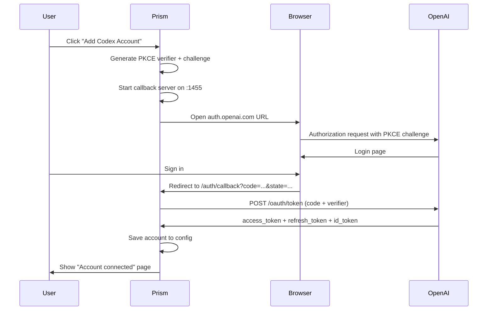

# OAuth and authentication

Active contributors: KavinMK05

## Purpose

Prism supports two authentication models: API key-based (for Ollama Cloud, OpenCode Go, and custom providers) and OAuth-based (for Codex/OpenAI accounts via PKCE flow).

## API key authentication

The proxy process validates incoming requests using middleware functions in `main.go`:

- `authMiddleware` — validates `x-api-key` header or `Authorization: Bearer` for the Anthropic Messages endpoint
- `openaiAuthMiddleware` — validates `Authorization: Bearer` for OpenAI-format endpoints

The proxy API key defaults to `prism` and is defined in `runProxyServer`.

## Codex OAuth flow

Prism implements the OAuth 2.0 Authorization Code flow with PKCE (Proof Key for Code Exchange) for authenticating with OpenAI accounts. The flow is defined in `oauth_codex.go`:

Key implementation details:

- The callback server listens on `127.0.0.1:1455` (fixed port)
- PKCE codes are generated with a SHA-256 challenge using `generatePKCE` in `oauth.go`
- OAuth flows are tracked in a `oauthFlows` map keyed by state, with a 10-minute expiry
- A timeout goroutine cleans up stale flows and shuts down the callback server after 5 minutes

## Token management

The `OAuthAccount` struct in `oauth.go` tracks authentication state:

- `AccessToken` — the current access token
- `RefreshToken` — for obtaining new access tokens when the current one expires
- `ExpiresAt` — Unix timestamp of token expiry
- `PlanTier` — extracted from JWT claims (plus, team, etc.)

The `getValidAccessToken` function in `oauth.go` automatically refreshes expired tokens. Token expiry is checked with a 60-second buffer.

## JWT parsing

Several utility functions parse JWT tokens to extract account information:

- `parseJWTPlanTier` in `usage.go` — extracts subscription plan from multiple JWT claim paths
- `parseChatGPTAccountID` in `oauth_codex.go` — extracts the ChatGPT account ID from the `https://api.openai.com/auth/chatgpt_account_id` claim
- `parseIDTokenEmail` in `oauth.go` — extracts email from the ID token

## Key source files

| File | Purpose |
|---|---|
| `oauth.go` | OAuth core types, callback server, token management, PKCE generation |
| `oauth_codex.go` | Codex OAuth flow (authorization URL, token exchange, browser launch) |
| `main.go` | `authMiddleware`, `openaiAuthMiddleware` |
