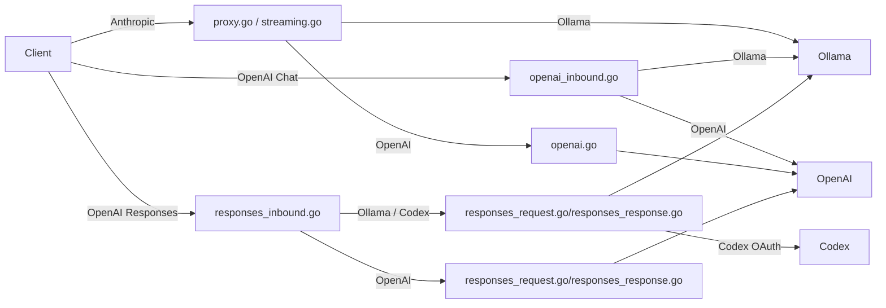

# Protocol translation

Active contributors: KavinMK05

## Purpose

Prism accepts API requests in three formats (Anthropic Messages, OpenAI Chat Completions, OpenAI Responses) and forwards them to an upstream provider that speaks a different format. The translation engine handles both the request and response sides, including content blocks, tool calls, thinking/reasoning blocks, and images.

## Routing paths

There are six distinct routing paths through the system:

## Content block translation

The most complex translation is content blocks. Anthropic and OpenAI use different block structures:

**Anthropic blocks**: `text`, `thinking`, `tool_use`, `tool_result`, `image`
**OpenAI blocks**: string content, `reasoning_content` (separate field), `tool_calls`, image parts
**Ollama blocks**: flat content string, `thinking` field, `tool_calls` array, `images` array

The translation functions in `proxy.go` (`translateContentBlocksWithToolLookup`, `translateMessageWithToolLookup`) and `openai.go` (`translateContentBlocksToOpenAI`) handle these mappings.

## Tool call mapping

Tool calls are mapped across formats with name resolution. When a tool result references a tool call ID, the translator scans prior assistant messages to build a tool call ID to function name mapping (`buildToolIDToNameMap` in `proxy.go`, `buildOpenAIToolIDToNameMap` in `openai_inbound.go`). This ensures tool results are correctly associated with their function names in the downstream format.

## Image handling

Images sent as base64 in Anthropic requests are extracted and forwarded as Ollama image arrays or OpenAI data URIs. For the OpenAI Responses API inbound path, `input_image` content parts with data URIs or file data are translated to the appropriate format.

## Key source files

| File | Purpose |
|---|---|
| `proxy.go` | Anthropic → Ollama request/response translation |
| `openai.go` | Anthropic → OpenAI request/response translation |
| `openai_inbound.go` | OpenAI Chat → Ollama/OpenAI translation |
| `responses_request.go` | Responses API → Chat Completions/Ollama translation |
| `responses_response.go` | Chat Completions/Ollama → Responses API translation |
