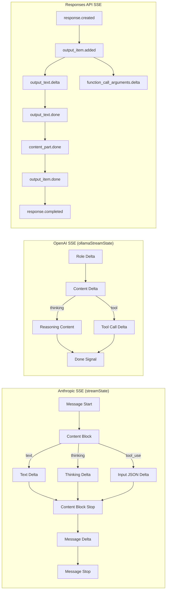

# Streaming

Active contributors: KavinMK05

## Purpose

All six routing paths support real-time SSE streaming. Prism reads streaming chunks from the upstream provider, translates them, and emits correctly-formatted SSE events to the client. Thinking/reasoning blocks, tool calls, and images are fully supported in all streaming paths.

## Streaming architecture

Each streaming path uses a state machine to track open content blocks:

## Anthropic-formatted streaming

The `streaming.go` file implements Anthropic SSE format for both Ollama and OpenAI upstreams. The `streamState` struct tracks:

- **thinking blocks** — open/close based on Ollama `thinking` field or OpenAI `reasoning_content`
- **text blocks** — open/close for text content deltas
- **tool_use blocks** — per-tool with `input_json_delta` events

For Ollama upstreams (`handleStreaming`), Prism reads newline-delimited JSON from the Ollama `/api/chat` streaming endpoint. For OpenAI upstreams (`handleOpenAIStreaming`), it reads standard SSE `data:` events from the OpenAI `/v1/chat/completions` streaming endpoint.

## OpenAI-formatted streaming

The `openai_inbound_streaming.go` file implements OpenAI Chat Completions SSE format for clients that send `/v1/chat/completions` requests. Key features:

- `ollamaStreamState` tracks thinking activity and buffers content during thinking phases
- Tool calls are deduplicated by name to handle Ollama's cumulative streaming format
- The `handleOpenAIInboundOpenAIStreaming` method passes through OpenAI SSE events with model remapping applied

## Responses API streaming

The `responses_streaming.go` file implements the full Responses API streaming event sequence for both Ollama and OpenAI upstreams. Events emitted:

1. `response.created` — response metadata
2. `response.output_item.added` — for each output item (message, function_call, reasoning)
3. `response.content_part.added` / `response.content_part.done` — for message content parts
4. `response.output_text.delta` / `response.output_text.done` — streaming text content
5. `response.reasoning_summary_part.added` / `.delta` / `.done` — for thinking/reasoning
6. `response.function_call_arguments.delta` / `.done` — for tool call arguments
7. `response.output_item.done` — for each completed output item
8. `response.completed` — final response with accumulated output and usage

The streaming handlers in `responses_streaming.go` accumulate `completedOutput` arrays and `completedOutputText` to include in the final `response.completed` event.

## Key source files

| File | Purpose |
|---|---|
| `streaming.go` | Anthropic SSE streaming (Ollama upstream) |
| `openai_streaming.go` | Anthropic SSE streaming (OpenAI upstream) |
| `openai_inbound_streaming.go` | OpenAI Chat SSE streaming (both upstreams) |
| `responses_streaming.go` | Responses API SSE streaming (both upstreams) |
