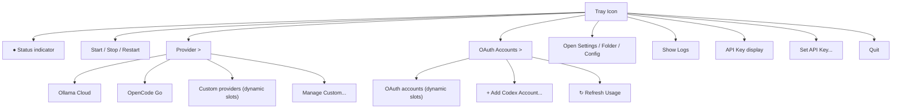

# System tray

Active contributors: KavinMK05

## Purpose

The native Windows system tray icon is Prism's primary user interface. It provides menu-driven control over the proxy lifecycle, provider selection, settings access, and log viewing.

## Menu structure

The system tray menu (`tray.go`) is organized into logical groups:

## Dynamic menu slots

The tray menu pre-allocates slots for custom providers and OAuth accounts:

- **Custom provider slots** — 10 pre-allocated slots hidden until a provider is configured
- **OAuth account slots** — 10 pre-allocated slots, showing email and usage percentage

Click handlers for dynamic slots are set up in loops, using closures to capture the slot index.

## Proxy lifecycle

The tray process manages the proxy process through three functions in `tray.go`:

- `startProxyProcess` — spawns `prism.exe --serve` as a hidden window, sets environment variables, redirects stdout/stderr to a log file
- `stopProxyProcess` — kills the proxy process via `taskkill /F`
- `isProxyRunning` — queries the process exit code using Windows API (`OpenProcess` + `GetExitCodeProcess`)

The proxy process is spawned with filtered environment variables to avoid leaking API keys from parent process environment into child processes. API keys are explicitly set via `OLLAMA_API_KEY` env var.

## Single-instance guard

The tray process creates a Windows mutex named `PrismSingleInstance` in `main.go` to prevent multiple instances. If the mutex already exists (`ERROR_ALREADY_EXISTS`), the process exits.

## Orphan process cleanup

Before starting the proxy, `killOrphanOnPort` scans `netstat -ano` output for processes listening on the proxy port and kills any that aren't the known PID. This handles stale proxy processes from crashes or improper shutdowns.

## Key source files

| File | Purpose |
|---|---|
| `tray.go` | Full tray menu setup, proxy lifecycle, orphan cleanup |
| `main.go` | Single-instance mutex, entry point |
