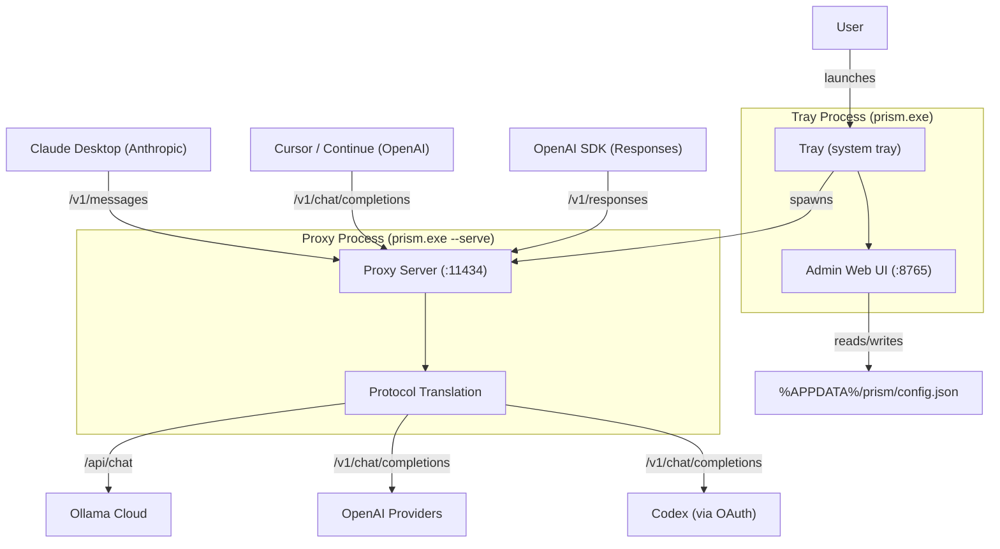

# Architecture

Prism uses a two-process architecture: the **tray process** (launched without arguments) manages the system tray icon and admin web UI, while the **proxy process** (launched with `--serve`) handles all API requests and translation.

## Tray process

The tray process (`tray.go`) is the main entry point when Prism is launched without arguments. It:

- Creates a single-instance mutex to prevent duplicate launches
- Registers a system tray icon with a full context menu
- Starts the admin web UI server on port 8765
- Manages the proxy process lifecycle (start, stop, restart)
- Handles menu actions: provider switching, OAuth login, settings, log viewer

The tray process uses the `github.com/getlantern/systray` library for native Windows tray integration, and embeds the admin UI HTML (`admin.html`) using Go's `embed` package.

## Proxy process

The proxy process is a separate OS process spawned by the tray process with the `--serve` flag. It:

- Listens on `127.0.0.1:11434` (configurable via `PRISM_PORT` and `PRISM_HOST`)
- Reads config from the same config file on disk
- Routes incoming requests to the appropriate translation path
- Forwards translated requests to the upstream provider
- Translates responses back to the client's expected format
- Emits SSE events for streaming requests
- Tracks request statistics in memory

## Translation engine

The core translation logic lives in six files, each handling a specific routing path:

| File | Path | Inbound format | Upstream format |
|---|---|---|---|
| `proxy.go` | `/v1/messages` | Anthropic Messages | Ollama `/api/chat` |
| `openai.go` | `/v1/messages` | Anthropic Messages | OpenAI `/v1/chat/completions` |
| `openai_inbound.go` | `/v1/chat/completions` | OpenAI Chat | Ollama or OpenAI |
| `responses_inbound.go` | `/v1/responses` | OpenAI Responses | Ollama or OpenAI |
| `streaming.go` | `/v1/messages` (stream) | Anthropic Messages | Ollama (streaming) |
| `openai_streaming.go` | `/v1/messages` (stream) | Anthropic Messages | OpenAI (streaming) |

## Data model layer

All API formats share a common set of Go structs defined in `models.go`:

- `AnthropicRequest` / `AnthropicResponse` — Claude API message format
- `OpenAIChatRequest` / `OpenAIChatResponse` — OpenAI chat completions format
- `OllamaChatRequest` / `OllamaChatResponse` — Ollama native chat format
- `ResponsesAPIRequest` / `ResponsesAPIResponse` — OpenAI Responses API format
- `OpenAIStreamChunk` / `OpenAIStreamChoice` — streaming chunk types

The `responses_models.go` file adds the Responses API-specific structs for the newer OpenAI API format.

## Config storage

Configuration is stored as JSON files in `%APPDATA%\prism\`:

- `config.json` — active provider, provider configs, OAuth accounts
- `model_remapping.json` — model aliases, known models, default model

## Key source files

| File | Purpose |
|---|---|
| `main.go` | Entry point, single-instance guard, server setup, middleware |
| `tray.go` | System tray UI, proxy lifecycle management |
| `admin.go` | Admin web UI server and API handlers |
| `config.go` | Config file management, provider lookup, model remapping |
| `proxy.go` | Core proxy: Anthropic to Ollama translation |
| `models.go` | All shared data model structs |
| `openai.go` | Anthropic to OpenAI translation |
| `openai_inbound.go` | OpenAI Chat inbound to Ollama or OpenAI |
| `streaming.go` | Anthropic to Ollama streaming |
| `openai_streaming.go` | Anthropic to OpenAI streaming |
| `openai_inbound_streaming.go` | OpenAI Chat inbound streaming |
| `oauth.go` | OAuth core types, callback handling, token management |
| `oauth_codex.go` | Codex OAuth flow (PKCE, token exchange) |
| `usage.go` | Usage tracking for OAuth accounts |
| `stats.go` | Live request statistics tracker |
| `responses_request.go` | Responses API to Chat/Completions/Ollama translation |
| `responses_response.go` | Chat/Completions/Ollama to Responses API translation |
| `responses_inbound.go` | Responses API inbound handler |
| `responses_streaming.go` | Responses API streaming (OpenAI and Ollama upstreams) |
| `responses_models.go` | Responses API data model structs |
